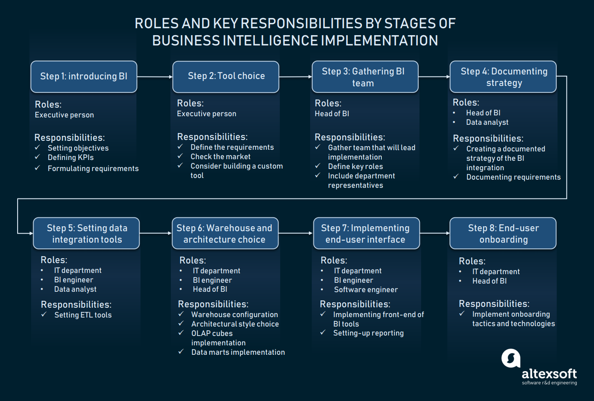
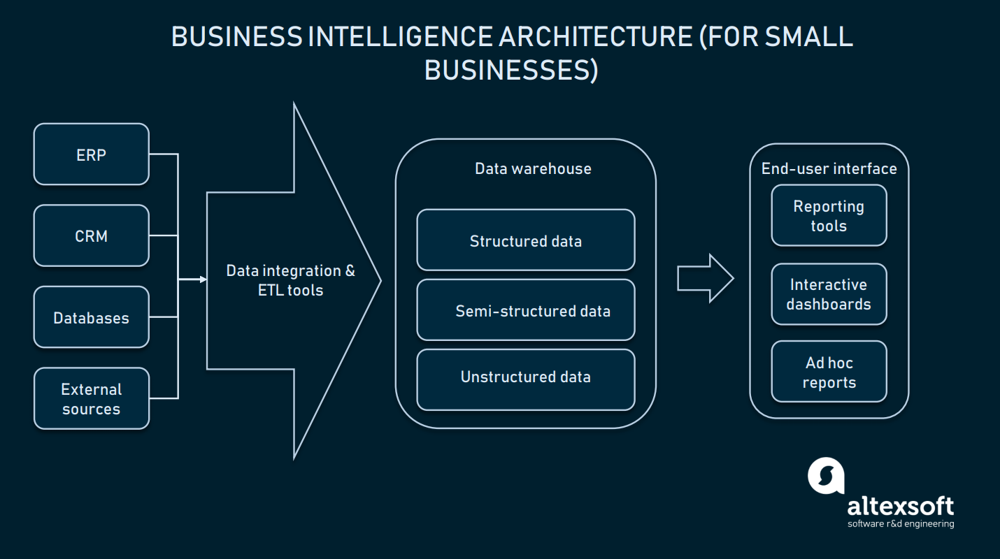
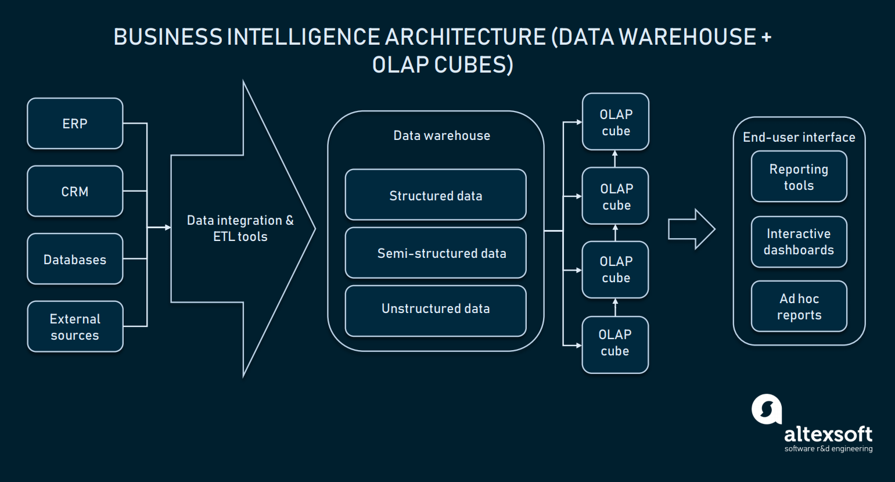
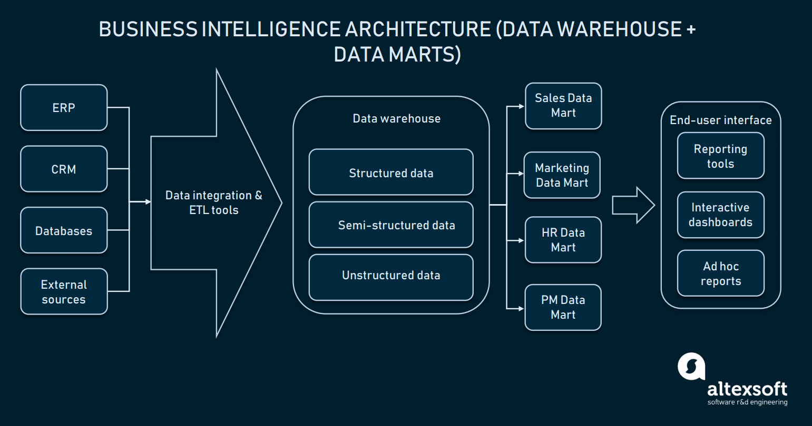
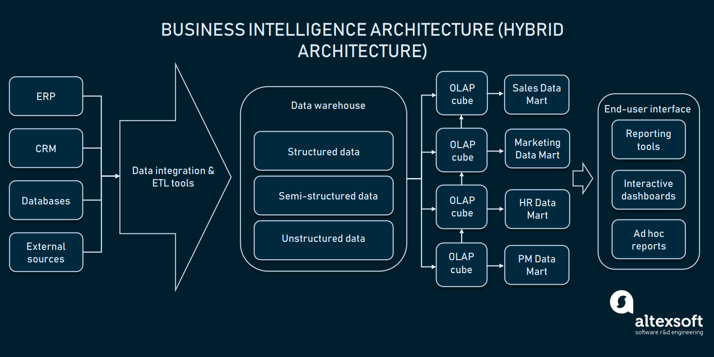

# Implementing Business Intelligence

## Step 1: Introduce business intelligence to your employees and stakeholders
Explain the meaning of BI to all the stakeholders and key people that will be involved in data management.

### Set the objectives
- What sources of data will be used? (CRM, ERP, website analytics, external sources, etc.)
- What type of data do we need to source? (sales numbers, reports, website traffic, etc.)
- Who needs access to this data? (top management, market analysts, other roles)
- What types of reports do we need and how must they be presented? (spreadsheets, diagrams, ad hoc reports, or interactive dashboards)
- How would progress be measured?

### Set the KPIs
- financial restraints (budget applied to development)
- performance indicators like querying speed or report error rate

### Set the requirements
- a list of features in a product backlog consisting of user-stories
- a more simplified version of this requirement document

The main point here is that, based on the requirements, you should be able to understand what architecture type, features, and capabilities you want from your BI software/hardware.

## Step 2: Choose tools or consider a custom solution
For large businesses, building its own custom BI ecosystem can be considered for the following reasons.
- Enterprise level organizations may not entrust their valuable data to a third party.
- BI tools mostly differentiate by serving the needs of some specific industry. There might be no vendor on the market that provides services for your industry.
- And the last reason is that processing large volumes of information or working with big data may serve a good reason to initiate custom BI development, instead of looking for the vendor, since you may have higher flexibility in terms of choosing a cloud infrastructure provider.

For smaller companies, there are many tools that cover nearly any kind of industry-specific data analysis in the BI market.

## Step 3: Gather a business intelligence team
Gather a group of people from different departments of the company to work on your business intelligence strategy, for the following reasons.
- They help to gather representatives from different departments to simplify communication.
- They get department-specific insights about required data and its sources.

The lineup of your BI team should include two main categories of people:
### Domain representatives from different departments
These people will be responsible for providing the team with access to data sources and contribute their domain knowledge to choosing and interpreting different data types.

### BI-specific roles
- Head of BI: armed with theoretical, practical, and technical knowledge to support the implementation of your strategy and actual tools
- BI engineer: a technical member of your team who specializes in building, implementing, and setting BI systems. Usually, BI engineers have software development and database configuration background.
- Data analyst: provide the team with expertise in data validation, processing, and data visualization

## Step 4: Document your BI strategy
Business intelligence strategy may include various components depending on your industry, company size, competition, and business model. However, the recommended components are:
- Data sources
- Industry/custom KPIs
- Reporting standards
- Reporting flow type and end-users
 - Traditional BI
 - Self-service BI

## Step 5: Set up data integration tools
### Data Warehouse
The warehouse is a database that keeps your information in a predefined format, usually structured, classified, and purged of errors

### ETL (Extract, Transform, Load)
If your data isn’t preprocessed, your BI tool or your IT department won’t be able to query it. For this reason, you can’t directly connect your data warehouse with your sources of information. Instead, you must use ETL (Extract, Transform, Load) tools or data integration tools.
- Data extraction: retrieves data from the data sources
- Data transformation: extracted data is analyzed, have duplicates removed, and then is standardized, sorted, filtered, and verified
- Data loading: transformed data is uploaded into the warehouse

## Step 6: Configure a data warehouse and choose an architectural approach

## Step 7: Implement the end-user interface: reporting tools and dashboards
In the past, business intelligence could produce only static reports, based on future and past events. Today, BI is capable of producing interactive dashboards with customizable portions of information. But templated reporting remains the most popular method of data presentation.

## Step 8: Conduct training for end users

---
## Refer to
[altexsoft](https://www.altexsoft.com/blog/business/complete-guide-to-business-intelligence-and-analytics-strategy-steps-processes-and-tools/)