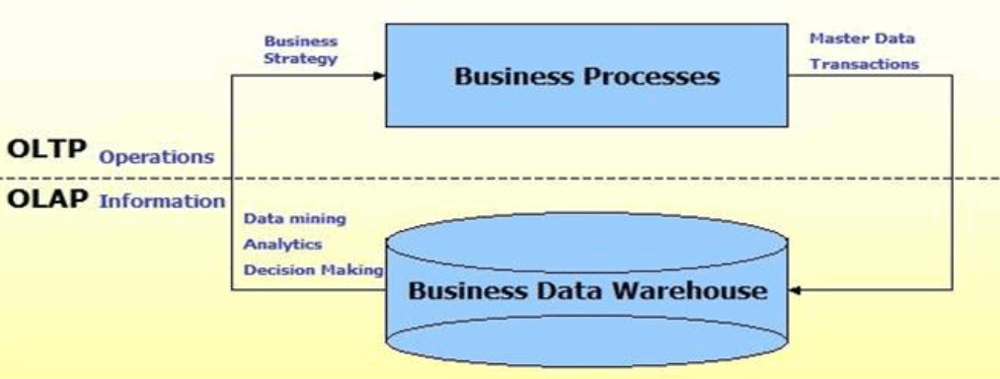
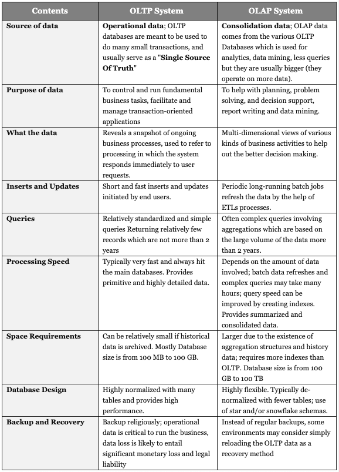
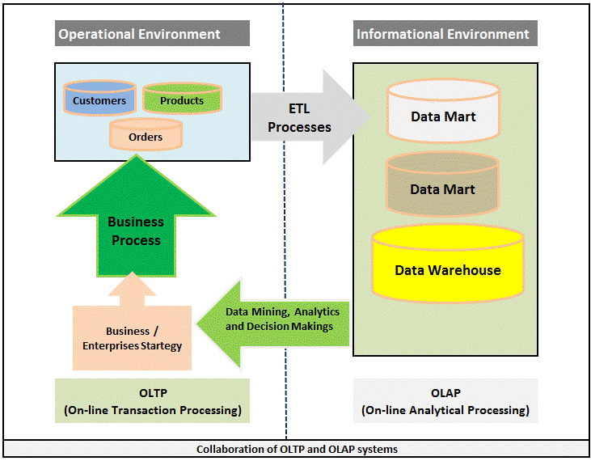

# OLTP vs OLAP

## OLTP (On-line Transaction Processing)
OLTP based systems (account, ticket booking, banking systems, money transfer system) are used to perform a large number of short transactions.

## OLAP (On-line Analytical Processing)
OLAP based systems are used for management decisions and these system known as Decision Support System (DSS).

## Collaboration of OLTP and OLAP systems

---
## Refer to
[SQL Datatools](http://www.sql-datatools.com/2015/08/dw-oltp-vs-olap.html)