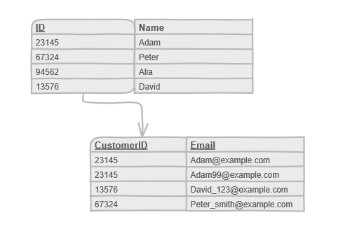
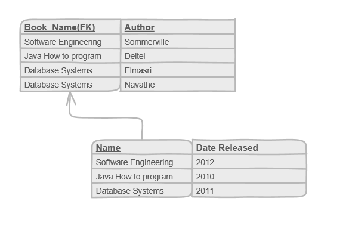
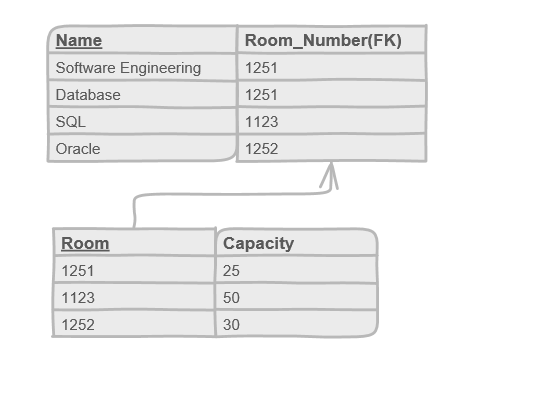

# Normalization

## First Normal Form
First normal form requires that every column should have one, and only one value; there is no multi-valued attribute, and there shouldn’t be repeating groups of data.

'Repeating group' means, for example, in a customer table, you should not havew two email addresses in the same email column, and you should not have two columns for email address. 

To solve this, create a seperate table just for email addresses with the original primary key as the foreign key.

## Second Normal Form
The problem arise when you have a composite primary key in a table. The second normal form requires that all of the non-primary columns have to be dependent on the entire (composite) primary key.

For example, in a book table, if the name of the book and the author of the book are the composite primary key in a table, release date should be dependant on both primary keys. However, release date only relies on the name of the book not the author.

To solve this, the table should be seperated into two tables.

## Third Normal Form
The third normal form is concerned with the non-key attribute that rely on another non-key attributes, and not the primary key.

For example, in a course table with the name of the course as the primary key, both romm number and capacity of the room should depend only on the primary key. However capacity of the room is only related the room number, not the name of the course.

To solve this, create a seperate table with the room numbrer as the primary key, and have the room number as a foreign key in the original table.

### Derived Attribute
If one column can be derived from another coloum, the derived column should be removed.

For example, in a score table, average column can be calculated when needed, so it should be removed.

## Denormalization
Sometimes you will hit the situation where you will break the normalization rules for performance improvements, because normalization is often involves splitting data into multiple tables.

For example, in a customer table, we can just have email address column and alternative email address column in the same table. Although it is a violation of the *First Normal Form*, it can improve the performance.

---
## Refer to
[Medium](https://medium.com/omarelgabrys-blog/database-normalization-part-7-ef7225150c7f)
