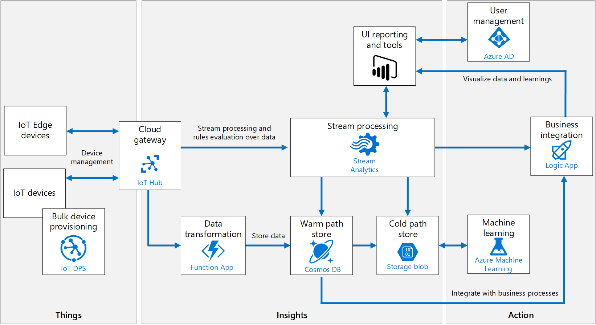

# Azure IoT Reference Architecture

IoT applications can be described as `things` (devices) sending data that generates `insights`. These insights generate `actions` to improve a business or process.

- hot path: analyzes data in near-real-time, as it arrives.
- cold path: performs batch processing at longer intervals (hourly or daily).

---

## Architecture

`IoT devices`
- connect to the cloud to send and recieve data
- may be `edge devices` that perform some data processing on the device itself
- Azure Iot Edge is recommended for edge processing

`Cloud gateway`
- provides a cloud hub for devices to connect securely to the cloud and send data
- provides device management, capabilities, including command and control of devices
- IoT Hub is recommended

`Device provisioning`
- registers and connects large sets of devices
- IoT Hub Device Provisioning Service (DPS) is recommended

`Stream processing`
- analyzes large streams of data records and evaluates rules for those streams
- Azure Stream Analytics is recommended

`Machine learning`
- allows predictive algorithms to be executed over historical telemetry data, enabling scenarios such as predictive maintenance
- Azure Machine Learning is recommended

`Warm path storage`
- holds data that must be available immediately from device for reporting and visualization
- Cosmos DB is recommended

`Cold path storage`
- holds data that is kept longer-term and is used for batch processing
- Azure Blob Storage is recommended

`Data transformation`
- manipulates or aggregates the telemetry stream. Examples include protocol transformation, such as converting binary data to JSON, or combining data points
- protocol gateway is recommended for data that needs to be transformed before reaching IoT Hub
- Azure Functions is recommended for data that needs to be transformed after reaching IoT Hub

`Business process integration`
- performs actions based on insights from the device data
- Azure Logic Apps is recommended

`User management`
- restricts which users or groups can perform actions on devices, such as upgrading firmware
- Azure Active Directory is recommended

## Refer to
[Microsoft](https://docs.microsoft.com/en-us/azure/architecture/reference-architectures/iot/)