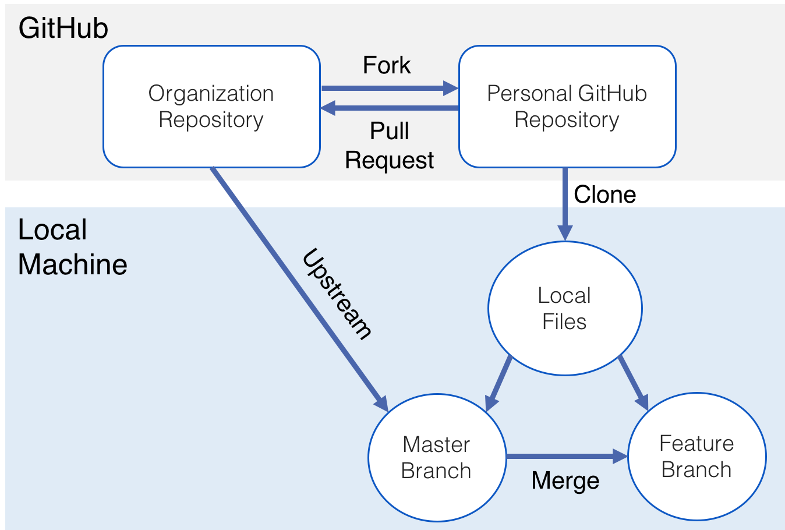
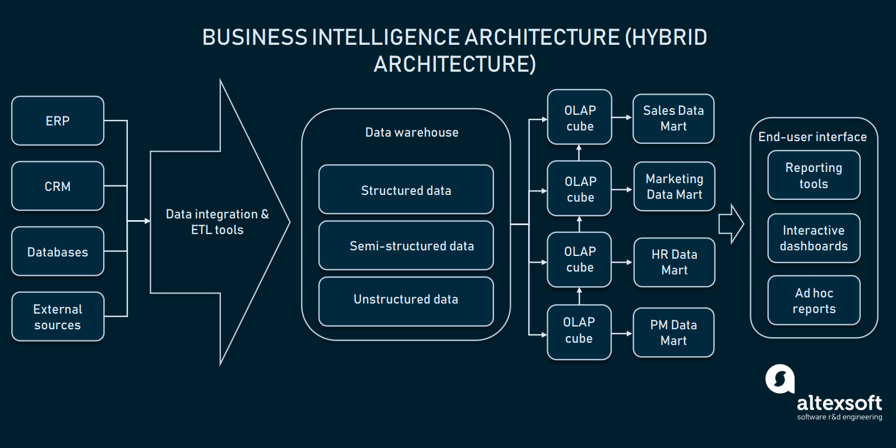
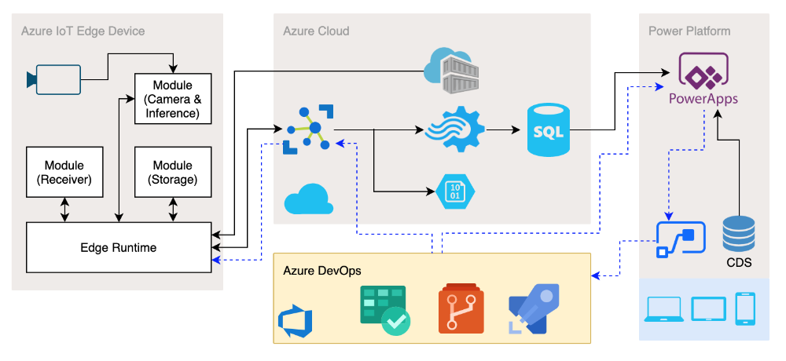

# Motojin OJT

## April 1, 2020

### Git

### SQL

- only use `left join`

### BI

- [Azure Storage](https://docs.microsoft.com/en-us/learn/browse/?term=storage&resource_type=learning%20path)
- [Data Factory](https://docs.microsoft.com/en-us/azure/data-factory/)
- Synapse

### Motojin

- Edge device (e.g. robot arm)
- Unity vs Flutter

## Refer to
[medium](https://medium.com/@sahoosunilkumar/how-to-update-a-fork-in-git-95a7daadc14e)
